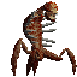
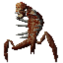

<h1 align="center">
  
  Cub3D
  
</h1>

Cub3D is a 3D raycasting engine written in C, inspired by classic games like Wolfenstein 3D. It allows the player to explore a maze from a first-person perspective, featuring basic movement, wall rendering, simple monster following, and player sprint, using the MiniLibX graphics library.

## Features

- First-person maze exploration
- Basic movement (forward, backward, strafe, turn)
- Wall rendering using raycasting
- Monster movement: monsters follow the player if within range
- Player sprint: temporarily increases movement speed
- Built with MiniLibX graphics library

## Getting Started

### Prerequisites

- GCC or another C compiler
- [MiniLibX](https://harm-smits.github.io/42docs/libs/minilibx/) installed

### Build & Run

Clone the repository:
```sh
git clone https://github.com/DiogoFTL-Gomes/Cub3D.git
cd Cub3D
```

Compile:
```sh
make
```

Run:
```sh
./cub3d [path_to_file/map_file]
```

How to play:
- WASD to move
- On Linux with X11 use mouse to rotate
- On WSL (Windows Subsystem for Linux) → use the arrow keys (← →) to rotate
- Press SHIFT to sprint
- Press E on doors to open and close.

- Press E on exit to open it and escape.

- Press Esc or click the window close button to exit

## Credits

Developed by [andrelencart](https://github.com/andrelencart) and [DiogoFTL-Gomes]((https://github.com/DiogoFTL-Gomes))
license

---

Feel free to update this README as your project progresses!
